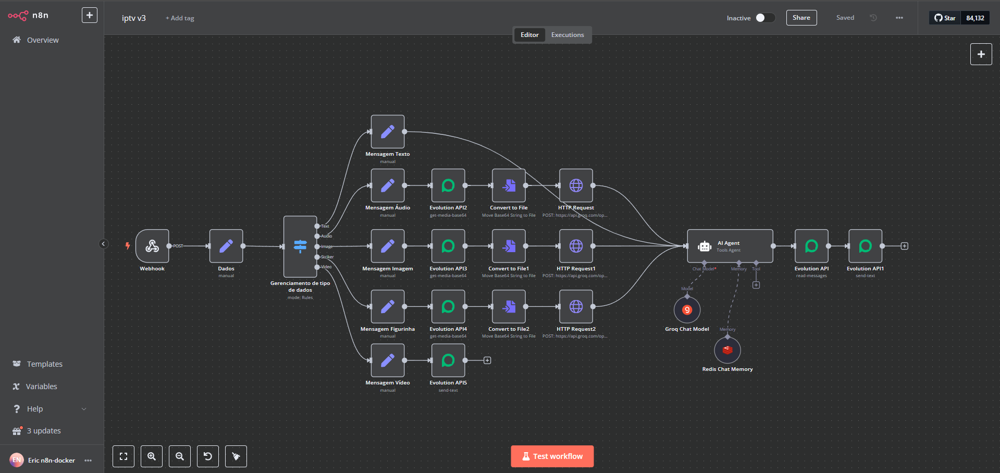

# IPTVinhoAI
# 📡 Automação n8n: iptv_v3


Este workflow foi desenvolvido no **n8n** com o objetivo de processar e classificar mensagens recebidas via Webhook de forma automática, identificando seu tipo (texto, áudio, imagem, vídeo, etc.) e organizando os dados recebidos.

---

## 🔁 Visão Geral do Fluxo

O fluxo é composto por etapas que seguem a seguinte lógica:

1. **Webhook (Trigger)**  
   Recebe requisições HTTP do tipo `POST` contendo dados de mensagens (ex: WhatsApp).

2. **Set: Dados**  
   Extrai e formata campos importantes da requisição, como:
   - Instância
   - Número do remetente
   - ID da mensagem
   - Nome do remetente
   - Conteúdo da mensagem
   - Tipo da mensagem (texto, áudio, imagem, etc.)
   - Data e hora da mensagem

3. **Switch: Gerenciamento de Tipo de Dados**  
   Um switch é usado para verificar o tipo da mensagem e encaminhar para o processamento correto. Os tipos tratados são:
   - `text`
   - `audio`
   - `image`
   - `stciker` (sic)
   - `video`

4. **Nós de Tratamento por Tipo**
   Cada tipo de mensagem é tratado em um nó separado, onde o conteúdo relevante é armazenado para posterior uso.

---

## 🧠 Lógica de Classificação

O campo `tipo_mensagem` é definido com base no conteúdo recebido, utilizando a seguinte lógica:

```javascript
{{
  (
    !!$json.body.data.messageType && $json.body.data.messageType === 'conversation' ? 'text' :
    $json.body.data.messageType === 'audioMessage' ? 'audio' :
    $json.body.data.messageType === 'imageMessage' ? 'image' :
    $json.body.data.messageType === 'stickerMessage' ? 'stciker' :
    $json.body.data.messageType === 'videoMessage' ? 'video' :
    $json.body.data.messageType === 'documentMessage' ? 'documento' :
    'outro'
  ).trim()
}}

```

⚙️ Pré-requisitos
Instância do n8n funcionando (Docker, Cloud ou local).

Node Webhook configurado para receber mensagens via POST.

Origem das mensagens deve enviar dados no formato esperado.

🧪 Teste do Webhook
Você pode testar localmente usando curl ou Postman:

```bash
curl -X POST http://localhost:5678/webhook/f585206b-1e16-4e83-82e9-85fee5128583 \
-H "Content-Type: application/json" \
-d '{
  "body": {
    "instance": "whatsapp01",
    "date_time": "2025-04-21T12:00:00Z",
    "data": {
      "key": {
        "remoteJid": "5511999999999@s.whatsapp.net",
        "id": "AB1234567890"
      },
      "pushName": "Fulano",
      "message": {
        "conversation": "Teste de mensagem"
      },
      "messageType": "conversation"
    }
  }
}'
```
📦 Estrutura dos Nós

Etapa	Tipo do Node	Objetivo
Webhook	Trigger	Receber dados de entrada
Dados	Set	Extrair campos importantes
Gerenciamento de Tipo	Switch	Direcionar conforme o tipo
Mensagem Texto	Set	Processar mensagens de texto
Mensagem Áudio	Set	Processar mensagens de áudio
...	...	Outros tipos (imagem, vídeo...)
🧰 Manutenção
Verifique periodicamente se o webhook está ativo.

Valide o formato das mensagens para evitar falhas de parsing.

Corrija o valor "stciker" para "sticker" se necessário.

## 📋 Requisitos e Integrações Externas

### 🔗 1. API Evolution (Origem dos dados)

A automação foi projetada para receber mensagens de entrada a partir da **Evolution API**, provavelmente relacionada ao envio de mensagens via WhatsApp ou similar.

- A API envia mensagens para o Webhook do n8n no formato JSON.
- Os campos esperados estão no corpo da requisição (`body.data.message`, `body.data.messageType`, etc.).
- Certifique-se de que a Evolution API esteja configurada para apontar para o endpoint do Webhook do n8n.

---

### 🤖 2. API da Groq (Integração com LLMs)

Caso o fluxo utilize **modelos de linguagem** (LLMs) para interpretar mensagens, gerar respostas ou classificar dados, pode haver integração com a **API da Groq**.

> A API da Groq oferece acesso a LLMs como o **Mixtral** e **Gemma** com alta performance, utilizando **latência extremamente baixa**.

- A chave da API deve ser armazenada de forma segura nas credenciais do n8n.
- Pode ser usada em um nó HTTP Request ou Código (JavaScript) com autenticação via Bearer Token.
- Exemplo de chamada com CURL:
  ```bash
  curl https://api.groq.com/openai/v1/chat/completions \
    -H "Authorization: Bearer SEU_TOKEN_GROQ" \
    -H "Content-Type: application/json" \
    -d '{ "model": "mixtral-8x7b-32768", "messages": [{ "role": "user", "content": "Olá!" }] }'

### 📦 3. Redis (Modo Fila - Execuções Distribuídas)
Para ambientes com alto volume de mensagens ou com múltiplos workers paralelos, recomenda-se ativar o modo fila com Redis.

Vantagens:
Permite que execuções do workflow sejam distribuídas entre múltiplos processos.

Evita travamentos na interface do n8n durante execuções pesadas.

Como configurar:
Adicione ao .env ou variáveis de ambiente:

```bash
EXECUTIONS_MODE=queue
QUEUE_BULL_REDIS_HOST=localhost
QUEUE_BULL_REDIS_PORT=6379
```
Redis deve estar acessível a partir da instância do n8n.

Todos os workers devem compartilhar a mesma base de dados e chave de criptografia.

Instalação do Redis (Docker):
```bash	
docker run -d --name redis -p 6379:6379 redis
```

📑 Resumo das Dependências Externas

Componente | Finalidade | Obrigatório?
Evolution API | Origem de mensagens WhatsApp/webhook | ✅ Sim
Groq API | Análise de mensagens com IA (LLMs) | ⚠️ Opcional
Redis | Modo fila para execução escalável | ⚠️ Recomendado em produção

📄 Licença
Distribuído sob a licença Fair-Code (n8n).